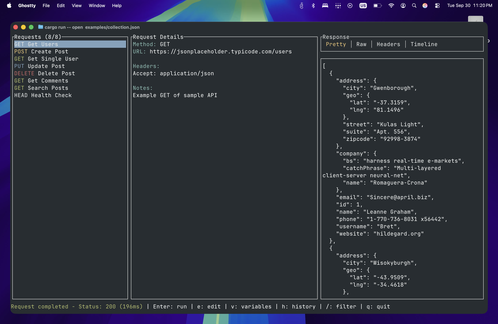

# Netbook

A lightweight, TUI-first "Postman-like" request collection manager and runner written in Rust.



## Features

- **Fast TUI Interface** - Built with ratatui for responsive terminal UI
- **Collection Management** - JSON and YAML support for request collections
- **Variable Interpolation** - Support for `{{variable}}` syntax with .env files
- **Response Viewer** - Pretty JSON, raw text, headers, and timing views
- **Request History** - Automatic saving and browsing of response history
- **Headless Mode** - Run requests from CLI for automation and CI/CD
- **Plugin System** - Extensible architecture for custom functionality
- **HTTP Methods** - Support for GET, POST, PUT, PATCH, DELETE, HEAD, OPTIONS

## Quick Start

### Installation

```bash
# Clone the repository
git clone <your-repo-url>
cd netbook

# Build the project
cargo build --release

# The binary will be available at target/release/netbook
```

### Basic Usage

```bash
# Open TUI with a collection file
netbook open examples/collection.json

# Run a request in headless mode
netbook headless-run "Get Users" --collection examples/collection.json

# Export last response
netbook export response.json
```

### Demo Walkthrough

1. **Try the example collection:**
   ```bash
   netbook open examples/collection.json
   ```

2. **Navigate requests:**
   - Use `↑`/`↓` or `j`/`k` to navigate requests
   - Press `Enter` to execute the selected request

3. **Filter requests:**
   - Press `/` to open filter mode
   - Type to filter by name, URL, or method
   - Press `Enter` to apply or `Esc` to cancel

4. **View responses:**
   - Use `Tab` to switch between Pretty JSON, Raw, Headers, and Timeline tabs
   - Responses are automatically saved to history

5. **Manage variables:**
   - Press `v` to view current variables
   - Variables can be defined in `.netbook.env` files

## TUI Keybindings

| Key | Action |
|-----|--------|
| `↑`/`↓`, `j`/`k` | Navigate requests |
| `Enter` | Execute selected request |
| `e` | Edit request (opens $EDITOR) |
| `/` | Filter requests |
| `v` | View/edit variables |
| `h` | Browse response history |
| `:` | Command mode |
| `Tab` | Switch response tabs |
| `s` | Save response value to variable |
| `q`, `Ctrl+C` | Quit |

## Collection Format

Netbook supports both JSON and YAML formats. Here's the structure:

```json
[
  {
    "name": "Get Users",
    "method": "GET",
    "url": "https://api.example.com/users",
    "headers": {
      "Accept": "application/json",
      "Authorization": "Bearer {{token}}"
    },
    "query": {
      "page": "1",
      "limit": "10"
    },
    "body": {
      "optional": "json body"
    },
    "notes": "Optional description"
  }
]
```

### Supported HTTP Methods

- `GET` - Retrieve data
- `POST` - Create new resources
- `PUT` - Update entire resources
- `PATCH` - Partial updates
- `DELETE` - Remove resources
- `HEAD` - Headers only
- `OPTIONS` - Check supported methods

## Variable Interpolation

Variables can be used anywhere in requests using `{{variableName}}` syntax.

### Variable Sources (in priority order)

1. **In-memory variables** - Set interactively in the TUI
2. **Environment file** - `.netbook.env` next to your collection file
3. **Process environment** - System environment variables

### Example .netbook.env file

```bash
# Base API configuration
baseUrl=https://api.example.com
token=your_bearer_token_here

# User settings
userId=123
apiVersion=v1
```

### Setting Variables from Responses

In the response pane, you can save response values to variables:
- Navigate to a JSON field
- Press `s` to save the value to a variable
- The variable becomes available for future requests

## Response History

Netbook automatically saves the last 100 responses to `~/.local/share/netbook/history.json`.

### Browsing History

- Press `h` in the TUI to browse response history
- Navigate with `↑`/`↓`, press `Enter` to view a historical response
- History includes request name, timestamp, and response status

### Exporting Responses

```bash
# Export the last response
netbook export last_response.json

# Export from history (programmatically)
netbook history export <entry_id> response.json
```

## Headless Mode

Run requests without the TUI for automation and CI/CD:

```bash
# Execute a specific request
netbook headless-run "Get Users" --collection api_tests.json

# Use in scripts
if netbook headless-run "Health Check" --collection monitoring.json; then
    echo "API is healthy"
else
    echo "API is down"
    exit 1
fi
```

## Plugin System

Netbook includes an extensible plugin system for custom functionality.

### Built-in Plugins

- **Example Logger** - Logs all requests to a file

### Creating Custom Plugins

Implement the `Plugin` trait:

```rust
use netbook::plugins::Plugin;
use async_trait::async_trait;

pub struct MyCustomPlugin;

#[async_trait]
impl Plugin for MyCustomPlugin {
    fn name(&self) -> &str {
        "My Custom Plugin"
    }

    async fn before_request(&self, request: &Request) {
        // Called before each request
        println!("About to execute: {}", request.name);
    }

    async fn after_response(&self, response: &Response) {
        // Called after successful response
        println!("Response status: {}", response.status);
    }

    async fn on_error(&self, error: &anyhow::Error) {
        // Called when requests fail
        eprintln!("Request failed: {}", error);
    }
}
```

Register your plugin in the `PluginManager`:

```rust
plugin_manager.register(Box::new(MyCustomPlugin));
```

## Design Decisions

### Why ratatui?

We chose [ratatui](https://github.com/ratatui-org/ratatui) over alternatives because:

- **Performance**: Efficient terminal rendering with minimal overhead
- **Cross-platform**: Works consistently on Linux, macOS, and Windows
- **Active Development**: Well-maintained with regular updates
- **Flexible Layouts**: Powerful layout system for complex UIs
- **Widget Ecosystem**: Rich set of built-in widgets

### Architecture Overview

```
┌─────────────────┐    ┌─────────────────┐    ┌─────────────────┐
│       CLI       │───▶│      TUI        │───▶│       UI        │
│   (clap args)   │    │  (app state)    │    │   (ratatui)     │
└─────────────────┘    └─────────────────┘    └─────────────────┘
         │                       │                       │
         ▼                       ▼                       ▼
┌─────────────────┐    ┌─────────────────┐    ┌─────────────────┐
│      Core       │    │       I/O       │    │     Plugins     │
│ (HTTP executor) │    │ (collections)   │    │   (hooks)       │
└─────────────────┘    └─────────────────┘    └─────────────────┘
```

## Future Improvements

### Planned Features

- **gRPC Support** - Add protocol buffer and gRPC request support
- **WebSocket Testing** - Interactive WebSocket connection testing
- **OAuth Flows** - Built-in support for OAuth 2.0 authentication
- **Request Chaining** - Automatic variable extraction and request sequencing
- **Performance Testing** - Load testing with request rate controls
- **Response Diffing** - Compare responses across different requests or time
- **Custom Scripts** - Pre/post-request JavaScript execution

### Technical Improvements

- **Dynamic Plugin Loading** - Load plugins at runtime from external libraries
- **Async UI Updates** - Non-blocking response streaming in TUI
- **Advanced Filtering** - Regular expressions and complex query filters
- **Themes** - Customizable color schemes and UI themes
- **Request Templates** - Generate requests from OpenAPI specs

